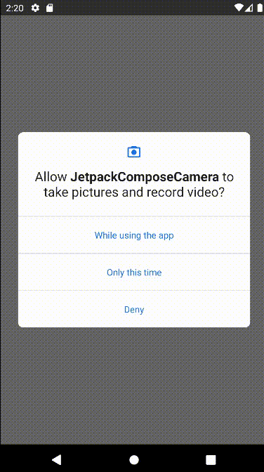

# Using the camera in 'Jetpack Compose'

## Libraries Used
* [Architecture][2]: In Compose the UI is immutable—there's no way to update it after it's been drawn.
* [Lifecycle][3]: A Composition is a tree-structure of the composables that describe your UI.
* [Jetpack-Compose][7]: Jetpack Compose is a modern toolkit for building native Android UI.
* [CameraX][9]: CameraX is a Jetpack library, built to help make camera app development easier.
* [Coil][10]: An image loading library for Android backed by Kotlin Coroutines

---
## App GIF
<p align="center">
  
</p>


```
MIT License

Copyright (c) 2023 Özkan TUNCEL

Permission is hereby granted, free of charge, to any person obtaining a copy
of this software and associated documentation files (the "Software"), to deal
in the Software without restriction, including without limitation the rights
to use, copy, modify, merge, publish, distribute, sublicense, and/or sell
copies of the Software, and to permit persons to whom the Software is
furnished to do so, subject to the following conditions:

The above copyright notice and this permission notice shall be included in all
copies or substantial portions of the Software.

THE SOFTWARE IS PROVIDED "AS IS", WITHOUT WARRANTY OF ANY KIND, EXPRESS OR
IMPLIED, INCLUDING BUT NOT LIMITED TO THE WARRANTIES OF MERCHANTABILITY,
FITNESS FOR A PARTICULAR PURPOSE AND NONINFRINGEMENT. IN NO EVENT SHALL THE
AUTHORS OR COPYRIGHT HOLDERS BE LIABLE FOR ANY CLAIM, DAMAGES OR OTHER
LIABILITY, WHETHER IN AN ACTION OF CONTRACT, TORT OR OTHERWISE, ARISING FROM,
OUT OF OR IN CONNECTION WITH THE SOFTWARE OR THE USE OR OTHER DEALINGS IN THE
SOFTWARE.
```

[2]:https://developer.android.com/jetpack/compose/architecture
[3]:https://developer.android.com/jetpack/compose/lifecycle
[4]:https://developer.android.com/jetpack/compose/navigation
[6]:https://developer.android.com/jetpack/guide#fetch-data
[7]:https://developer.android.com/jetpack/compose/tutorial
[9]:https://developer.android.com/training/camerax
[10]:https://coil-kt.github.io/coil/compose/
